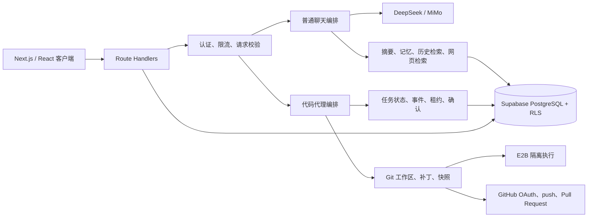

# MyChat 后台架构

## 总览

后台运行在 Next.js App Router Route Handlers 上，Supabase 同时承担认证、PostgreSQL 数据存储和 RLS。普通聊天与代码代理共用模型调用基础设施，但代码代理额外经过任务状态机、工作区、隔离执行、快照和 GitHub 发布层。

## 目录职责

| 目录 | 职责 |
|---|---|
| `app/api/chat` | 普通聊天入口、配额与 SSE 输出 |
| `app/api/code` | 代码代理会话、任务执行与 apply/publish |
| `app/api/agent` | 任务、事件、确认和工作区管理接口 |
| `app/api/auth`、`app/api/github` | Supabase 匿名认证与绑定用户的 GitHub OAuth |
| `app/api/endpoints` | 自定义 OpenAI-compatible 端点发现、流式验证和加密凭据管理 |
| `lib/llm` | 请求校验、上下文构建、模型轮次、工具循环、媒体生成、摘要和主动检索 |
| `lib/tools` | 网页、URL、记忆等模型工具；外部内容按不可信输入处理 |
| `lib/agent` | 状态机、数据库写入、路径安全、执行、快照、恢复与 Git 发布 |
| `lib/api` | 通用认证/配额门卫、有限 JSON 读取与响应 |
| `supabase/migrations` | 数据结构、原子函数、索引和 RLS 的唯一演进记录 |

## 关键请求流

### 普通聊天

1. 有限流式读取 JSON，并验证消息角色、文本、图片、附件与上下文总量。
2. 解析 Supabase 用户；匿名和登录用户都接受 IP/用户限流与配额检查。
3. 服务端构建 system context，按需读取记忆、对话摘要和历史片段。
4. agent loop 调用模型并执行受控工具；每轮有超时、取消信号、最大轮数和续跑上限。
5. 经过内容过滤器输出 SSE；已发生的 token 消耗即使请求后续失败也会原子记账。
6. 长对话摘要使用 compare-and-set 更新，避免并发覆盖新摘要。

### 代码代理

1. 校验用户、task/repo/session 绑定和请求上限。
2. 数据库原子领取任务租约，防止同一任务被两个实例同时运行。
3. 恢复 run state，执行有限轮数的模型/工具循环，并定期续租。
4. 文件工具先校验 workspace 根目录、敏感路径和符号链接；修改前创建可恢复快照。
5. 命令只在 E2B 中执行。非生产环境只有显式启用危险开关时才允许受控本机执行。
6. 完成后生成静态 diff/验证 artifact。发布经过风险分类与一次性人工确认。
7. Git 操作使用参数数组而不是 shell 拼接；push 和 PR 可幂等重试。

## 数据一致性

- 配额使用 `record_quota_usage` 在数据库内锁行并原子累加。
- 邀请码使用 `redeem_invitation_code` 原子检查、兑换与加余额。
- task meta/run state 通过数据库函数合并，避免并发读改写丢字段。
- agent event/step 使用数据库 sequence，不再通过 `max(seq)+1` 竞争。
- task run lease 带 owner 与过期时间；只有租约持有者可以续租或释放。
- GitHub cookie 加密并记录 Supabase user id，不能跨应用账号复用。
- 自定义模型 Key 使用用途隔离的 AES-GCM 加密；浏览器只持有端点 ID，不读取已保存 Key。
- 自定义端点网络请求将 DNS 解析结果固定到实际 socket；生产私网需精确 allowlist，链路本地和云元数据始终阻止。
- 图片和视频响应有独立字节上限；媒体以受限 URL/Data URL 事件传输，不混入模型名或思考状态文本。

## 安全边界

- RLS 是数据库最终边界，服务端查询仍显式附带 `user_id`/父记录归属条件。
- 客户端对 profile 只拥有偏好列权限，余额和 quota 只能由 SECURITY DEFINER RPC 修改。
- URL 抓取阻断私网、localhost、IPv4/IPv6 回环、URL 凭据和重定向后的不安全目标。
- 网页/搜索结果不会拼成高优先级指令；模型必须把它们当作不可信资料。
- workspace 拒绝路径穿越、符号链接段和凭据配置；上传 E2B 前扫描疑似密钥。
- artifact iframe 使用最小 sandbox 权限，SVG 不通过 `dangerouslySetInnerHTML` 注入。

## 有意保留的基础设施约束

API 短周期限流目前是单进程内存实现，适合单实例与开发环境；多实例生产必须在边缘网关或 Redis 增加共享 IP/user 限流。数据库配额与任务租约不受此限制。E2B workspace 当前以每次命令上传本地工作区来换取隔离性，大仓库应进一步引入增量同步与对象存储。

## 维护原则

- 新写接口先使用 `lib/api/request.ts` 做有限读取，再做业务验证。
- 新增子表必须同时有外键、父记录所有权 RLS 和服务端 `user_id` 过滤。
- 任何 read-modify-write 共享字段都应下沉为原子数据库函数。
- 不允许把用户字符串拼入 shell；Git 和进程调用使用参数数组。
- 模型循环必须有 request abort、单次超时、总轮次和空转上限。
- 删除接口前先搜索前端/测试/文档调用，删除后同步更新架构和部署资料。
