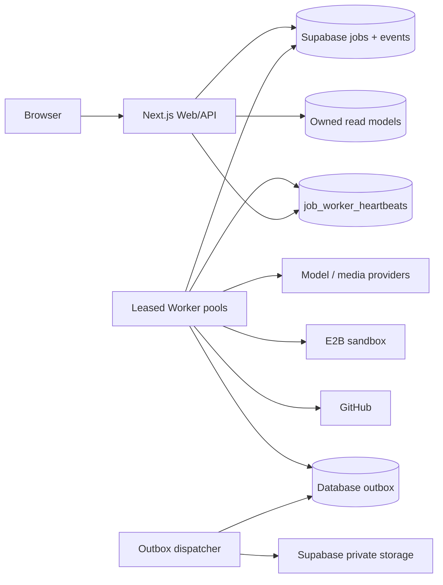

# Architecture

This project uses a layered Next.js architecture with explicit browser/server boundaries. The goal is to keep entry points thin, domain code testable, and infrastructure details replaceable without requiring an immediate rewrite of legacy modules.

## Dependency direction

```text
app/page.tsx ───────► components ───────► browser-safe lib modules
      │                                      │
      └──────────────────────────────────────┘

app/api/**/route.ts ─► server services ─────► server infrastructure
                           │                         │
                           └────────► domain ◄──────┘
```

- `app/` is the delivery layer. Pages compose UI; route handlers authenticate, validate, call a service, and translate the result to HTTP.
- `components/` contains client presentation and interaction. It can use browser-safe utilities and browser data gateways, but cannot import server runtimes.
- `lib/data/` and `lib/supabase/client.ts` are browser data gateways. Components may call them; API routes and server services may not execute them.
- `lib/api/`, `lib/agent/`, `lib/code-tools/`, `lib/tools/`, server Supabase, quota, rate-limit, and generation persistence/runtime modules are server-only.
- Pure domain types, parsers, policies, and transformations live in browser/server-neutral `lib/` modules. They must not depend on `app/` or `components/`.

Dependencies point inward: `lib/` never imports UI or framework entry points, and API routes never import components. Type-only imports can cross the browser/server split when the target is a declaration-only contract; runtime imports cannot.

## Module contracts

For new work:

1. Keep route handlers focused on transport concerns. Put orchestration in a named service module.
2. Keep components focused on rendering and interaction. Extract stateful workflows to focused hooks and pure transformations to `lib/`.
3. Import the narrowest module that owns a symbol. Avoid adding broad barrels that hide subsystem ownership.
4. Put shared request/response shapes in a neutral contract module, not in a route handler or server implementation.
5. Keep browser and server Supabase clients separate. A module that imports Node APIs, secrets, cookies, or privileged credentials is server-only.

## Automated guardrails

Run `npm run architecture` locally. The checker validates:

- forbidden dependency directions and browser/server crossings;
- Node and Next.js server runtime imports from client components;
- runtime dependency cycles;
- per-layer file-size budgets;
- local dependency fan-out budgets.

`npm run quality` runs the architecture check, the closed migration-manifest contract, strict TypeScript, zero-warning backend and project-wide ESLint gates, and unit/integration tests with minimum exercised-module coverage gates of 80% lines, 80% branches, and 80% functions. Warnings fail the build in every production, browser, script, and test path. The architecture checker also rejects library modules that are unreachable from runtime entry points, preventing test-only production code from accumulating. `npm run verify` adds a production dependency audit, an actual PostgreSQL 16 baseline/expand/replay/contract migration verification (including concurrent rate-limit contention and the immutable schema attestation), a production build, and Playwright smoke tests against `next start` on desktop Chromium and a Pixel 7 viewport. Pull requests and pushes to `main` run this same complete gate in CI.

The budgets in `scripts/architecture-baseline.json` are enforceable ceilings: API entry points default to 300 lines, components to 350, libraries to 400, and every module to at most 18 local runtime dependencies. The checker rejects stale exceptions after a file shrinks, so temporary debt can only move downward. The current baseline contains no size, fan-out, or cycle exceptions.

## Current feature boundaries

The largest workflows are organized as feature packages with thin public entry points:

- `lib/chat/` owns model selection, media responses, history preparation, attachment OCR, and durable chat streaming.
- `lib/code-agent/` owns code-agent request validation, task context, prompts, runtime state, apply/publish orchestration, and SSE orchestration.
- `components/literary-chat/`, `components/code-console/`, `components/sidebar/`, and `components/agent-tasks/` separate workflow hooks from presentation.
- `lib/llm/media-generation/` and `lib/llm/openai-compatible/` isolate protocol transport and network-security policy behind stable facades.
- `lib/agent/snapshot/` and `lib/agent/git-publish/` isolate persistence, recovery, Git, pull-request, and publishing responsibilities.

Future changes must keep these dependency directions and budgets intact. Do not move code into a new oversized file or create a facade cycle to satisfy a budget mechanically.

## 运行时拓扑

生产控制面以 Supabase PostgreSQL 为事实源。API 只负责认证、限流、校验、入队、查询、取消和恢复；模型调用、媒体生成、沙箱命令与 GitHub 发布在 Worker 中执行。架构门禁会拒绝 `app/api/**` 直接依赖模型循环、provider transport、E2B 或本地子进程执行模块。



固定生产消费者集合为 `chat`、`media`、`title`、`agent` 和 `outbox`。数据库 `jobs` 表是当前队列实现；仓库没有接入 RabbitMQ、Kafka 或外部 workflow engine。数据库协调使多个 Worker 实例可以安全竞争，但是否真正拆成多个实例取决于部署平台。

`scripts/start-production.mjs` 支持三种 `MYCHAT_RUNTIME_ROLE`：

- `all`：同时监管 Web 与 Worker；这是默认值，也是当前 `render.yaml` 的免费生产形态。
- `web`：只启动 Next.js，供 Web 独立扩容。
- `worker`：只启动 `job-worker.ts`，供消费者独立扩容。

当前生产 Blueprint 只声明一个 Render Web service，因此 Web 与 Worker 仍共享 CPU、内存、发布和故障域。角色拆分是已经实现并测试的代码能力，不等于已经配置了第二个服务、独立自动扩缩容或高可用集群。

## Unified Job 控制面

聊天文本、图片/视频、标题、Agent 运行和 Agent 发布都进入统一 Job 状态机：`queued → leased → running`，可进入 `awaiting_input` 或 `cancelling`，最终只能是 `completed`、`failed`、`cancelled` 之一。Job 身份、输入摘要、预算和终态不可由浏览器直写；状态转换、单调事件序号和终态不可复活由数据库约束与 service-role RPC 共同保护。

用户读面是归属过滤后的 `/api/v1/jobs/:id`、事件 SSE、取消和恢复接口。错误使用带 `request_id`、明确 `code` 与 `retryable` 的 v1 envelope；API 不把异常堆栈或服务端凭据返回给客户端。

### Lease、fence 与取消

Worker 用 `FOR UPDATE SKIP LOCKED` 原子 claim。每次 claim 或过期接管都会增加 `lease_version`；续租、事件、checkpoint、记账、重试和终态提交都必须同时匹配 `job_id + worker_id + lease_version`。旧 Worker 即使在暂停后恢复，也不能越过新 fence 写入。

取消是数据库 CAS。Worker 在续租、变更和终态前观察取消标记；取消与完成竞争只接受数据库中先提交的合法终态。进程收到 SIGTERM/SIGINT 后停止 claim，给在途作业受限的收尾时间；SIGKILL 后没有清理假设，恢复依赖租约过期与新 fence。

### Checkpoint 与等待用户输入

`job_checkpoints` 每个 Job 保存一个带版本的权威 envelope：`phase`、`data`、`progress`、`resumable`、`leaseVersion` 和更新时间。数据库还保存 checkpoint commit key、attempt、状态和 accounting digest 作为内部回执；这些字段不进入 Handler 的业务轨迹。Handler 恢复时只消费 envelope 中的 `data`，不能把数据库元数据误当业务轨迹。

存在 checkpoint 时，过期租约只有在最新记录明确 `resumable=true`，并且不存在不确定或不可安全重放的工具副作用时才能接管。没有 checkpoint 的旧 Job 当前按可恢复候选处理，但仍受 tool-effect 安全检查约束；因此 Handler 必须在进入不可幂等阶段前写 checkpoint，不能把这个兼容分支当作重放保证。非 resumable checkpoint 或含歧义副作用的 Job 会 fail closed，而不是猜测性重跑。运行中和进入 `awaiting_input` 的 checkpoint 都通过 `checkpoint_job_with_accounting` 提交：checkpoint CAS、fence、attempt 和尚未确认的不可变 ledger delta 在同一事务成功或回滚；进入等待态时同一事务还会释放 lease。旧 `checkpoint_job` 签名仅保留给历史结构探针，调用会明确失败。`POST /api/v1/jobs/:id/resume` 使用用户归属、预期 checkpoint version、幂等键和 CAS 把作业重新入队。

### Tool effects

有副作用的工具执行先在 `job_tool_effects` 持久化 effect key、参数摘要、状态和 fence。已成功且保存了完整内联结果的 effect 可校验 SHA-256 后返回原结果；成功但结果被截断、摘要不匹配，或状态仍为 `running`、`unknown`、含歧义的失败，都会返回 `JOB_RETRY_UNSAFE`，不会再次执行。

这提供的是“可证明时重放，否则拒绝”的 at-least-once 控制，不宣称所有外部系统具备 exactly-once 语义。新增外部副作用必须先定义稳定的 provider idempotency key、结果回执或补偿流程。

### Outbox 与受控 redrive

Job 终态、poison 通知和媒体清理消息与业务状态在同一数据库事务写入 `job_outbox`。Dispatcher 对 outbox 使用独立 lock version 和续租；`assets.cleanup` 会执行私有 Storage 清理，`jobs.terminal` 与 `jobs.poison` 当前只进入 dispatcher 观察/日志路径。仓库尚未把这些 lifecycle 主题发布到 Kafka、webhook 或第三方 event bus。

失败交付按退避重试，耗尽后成为 `dead`。人工恢复只能通过 `redrive_job_outbox` 或封装它的 `npm run outbox:redrive`：必须提供 dead row 的预期 `lock_version`、稳定请求键、actor 和原因。RPC 仅接受 dead 状态，增加新的 lock fence，受 `max_redrives` 限制，并在同一事务追加不可变审计记录；禁止直接 `UPDATE job_outbox` 绕过 CAS。

### Budget 与 ledger

预算维度包括 wall time、原始 token、估算成本、沙箱时间和工具调用数。预算 JSON 在 TypeScript 与数据库两侧校验；Worker 在执行前、工具/沙箱使用后和终态前检查累计值，超限以不可重试的 `JOB_BUDGET_EXCEEDED` 终止。

Handler 报告的是当前 attempt 的累计 usage；`JobBudgetController` 将相邻累计值转换为带内容寻址键的不可变 delta。每次 provider usage 回调都在模型循环继续或返回前通过当前 fence 刷新 ledger；checkpoint 会把仍未确认的 usage/resource delta 与恢复点放在同一事务。一个 pending batch 只有在数据库明确返回 commit/replay 后才被 ack，后续 flush、checkpoint 和终态只发送未确认部分。`ledger_entries` 以 Job、attempt 和不可变键去重；数据库拒绝记账时模型循环、checkpoint、重试或终态转换 fail closed。claim 返回此前 attempt 的持久累计量，因此接管不会重置预算，也不会把历史 token 再计入新 attempt。

这个 contract 不宣称 provider exactly-once。若 provider 已完成计费，但进程在解析 usage 或完成 awaited `onUsage` 前被 SIGKILL，数据库没有可提交的权威数值；usage 已落账但 provider 响应尚未形成恢复 checkpoint 时，接管也可能重发带相同稳定 Idempotency-Key 的请求。ledger 原子性不能补造 provider 没有交付的回执，也不能强迫 provider honor 幂等键。数据库内部 reservation/ledger/journal reconciliation 已实现，provider response receipt、账单导入与差异补录仍是未实现能力。

## Worker presence、readiness 与维护

Worker 每 5 秒把 revision、队列集合、容量、启动时间和 draining 状态写入 `job_worker_heartbeats`。`/api/ready` 要求 20 秒内有非 draining Worker 覆盖全部五个固定队列；Web 进程不会用自己的内存计数冒充跨进程 Worker 健康。`/api/metrics` 同样从数据库读取 fleet 与 Job 权威快照，并在数据库或解析失败时返回 `503`。

`MYCHAT_MAINTENANCE_MODE=drain` 是统一维护开关，旧的 `GENERATION_MAINTENANCE_MODE=true` 仍作为兼容别名。drain 会在读取大请求体和执行昂贵命令前拒绝新的聊天、标题、Agent、发布与 `awaiting_input` 恢复请求；Worker 只发送 draining heartbeat，不再 claim。状态读取和取消仍可使用。维护实例可保持读流量 ready，但返回体显式标记 `checks.worker.draining=true`；生产发布校验脚本会拒绝把 draining revision 当作完成部署。

`/api/live` 是依赖无关的进程 liveness。`/api/health` 是兼容端点：默认始终返回 HTTP 200，但响应仍报告依赖状态；`/api/health?ready=1` 与 `/api/ready` 才以 HTTP 503 fail closed。严格 readiness 覆盖认证配置、数据库 contract、分布式限流、数据库队列、Worker fleet 和生产 E2B 隔离。探针只返回布尔状态与安全 revision，不泄露 URL、密钥或 Worker ID。

## 媒体、投影与清理一致性

- 浏览器先建立严格归属的 canonical assistant placeholder，随后 API 原子入队；Worker 在调用 provider 前必须持有 Job fence。
- `chat_generations` 和 assistant message 是统一 Job 的兼容读模型投影。终态正文、思考、媒体、错误和 sequence 在数据库事务中镜像，客户端按 sequence 幂等合并。
- 上游媒体由服务端完成 SSRF、DNS、重定向、MIME 与大小校验后，上传到用户/会话/Job 作用域的私有 Storage。只有数据库确认的 canonical 引用会进入终态。
- 历史删除先在数据库事务验证归属、锁定会话、写清理回执并删除业务行，再由 outbox 清理 Storage；失败不会静默丢失。

## 已实现边界与未部署基础设施

| 能力 | 仓库当前状态 | 生产外部状态 |
| --- | --- | --- |
| 多实例安全 Job、lease、fence、checkpoint、ledger、outbox | 已实现，PostgreSQL 16 迁移与并发/恢复测试覆盖 | 依赖生产按顺序应用迁移 |
| Web/Worker 分离 | `all|web|worker` 已实现并测试 | 免费 Render Blueprint 仍使用单服务 `all` |
| Worker fleet readiness | 数据库 heartbeat、严格 `/api/ready`、权威 metrics 已实现 | 当前没有独立 Worker autoscaler |
| Prometheus/Grafana | 受保护 exporter、告警规则和 dashboard 资产已入库 | 仓库不创建托管 Prometheus、Grafana 或 Alertmanager |
| Trace | 日志与 request/job correlation 已存在 | OpenTelemetry collector 和跨服务 trace backend 未接入 |
| Lifecycle event bus | 数据库 outbox、锁、退避、dead/redrive 已实现 | Kafka/webhook publisher 未接入；非 cleanup 主题目前为观察/日志 |
| 高可用与容灾 | 数据库协调支持多实例 | 免费生产仍是单 Render service、共置故障域；跨区域 Worker、自动故障转移和演练环境未配置 |
| 财务对账 | reservation、ledger、balance movement/journal 与数据库权威 reconciliation 已实现 | provider 账单导入和外部差异补录未实现 |

详细发布、迁移、回滚、Outbox redrive、密钥轮换和故障演练步骤见 [部署与运行 Runbook](deployment-runbook.md)。指标语义、SLO 和告警见 [Job 可观测性](observability.md)。
